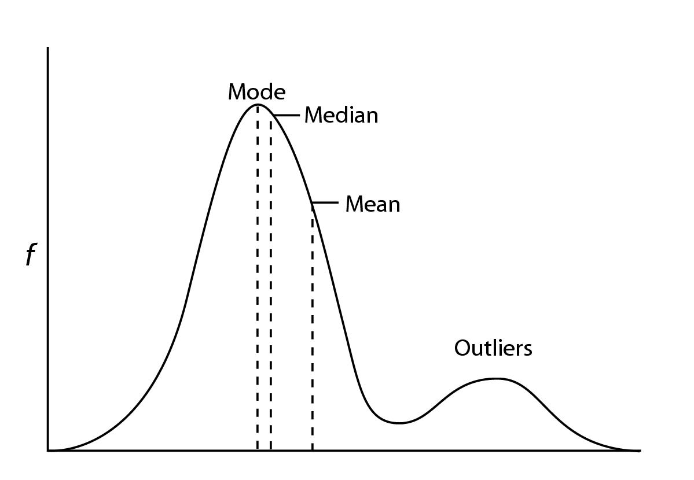

# 기대값

### 확률 분포의 기대값

만일 확률 변수가 따르고 있는 확률 모형, 정확히는 확률 밀도 함수를 알고 있을 경우에는 다음과 같은 수식을 사용하여 이론적인 평균을 구할 수 있다. 

이러한 이론적 평균을 확률 변수의 **기댓값(expectation)** 이라고 한다. 확률 모형이 존재한다는 것이 문맥상으로 확실한 경우에는 단순히 평균(mean)이라고 말하기도 한다.

확률 변수의 기댓값을 구하는 연산자(operator)는 영어 Expeaction의 첫글자를 사용하여 $$E[.]$$로 표기한다.
기대값은 그리스 문자 $$\mu_X$$ 로 표기한다. 확률 변수를 혼동할 경우가 없으면 확률 변수 이름은 생각하고 그냥 $$\mu$$ 라고 쓴다.

이산 확률 변수의 기댓값은 확률 변수에서 나올 수 있는 값, 즉 표본 공간의 원소 $$x_i$$ 의 가중 평균이다.
가중치는 $$x_i$$ 가 나올 수 있는 확률 즉, 확률 질량 함수 $$P(X_i)$$ 이다.

$$\mu_X = E[X] = \sum_{x_i\in\Omega}x_iP(x_i)$$

 

참고로 샘플 평균을 구하는 공식은 아래와 같다. 두 식에서 $$x_i$$ 의 의미가 다르다는 점에 유의해야한다.

$$m=\bar x = 1/N\sum_{i=1}^Nx_i$$

 

연속 확률 변수의 경우에는 다음과 같이 확률 밀도 함수 $$f(x)$$ 를 가중치로 $$x$$ 로 적분하여 기댓값을 구한다.

$$\mu_X =E[X] = \int_{-\infty}^{\infty} xf(x)dx$$

### 확률 밀도 함수의 모양과 기댓값

기댓값은 여러가지 가능한 $$x$$ 의 값들을 확률 밀도 값에 따라 가중합을 한 것이므로 가장 확률 밀도가 높은 $$x$$ 값 근처의 값이 된다. 즉, 확률 밀도가 모여 있는 근처의 위치를 나타낸다.

### 확률 변수의 변환

어떤 확률 변수 $$X$$ 와 $$Y$$ 를 가정하자.

새로운 확률 변수 $$2X$$ 는 확률 변수 $$X$$ 에서 나온 값을 2배한 값이 나오도록 하는 확률 변수를 뜻한다. 마찬가지로 새로운 확률 변수 $$X+Y$$ 는 확률 변수 $$X$$ 에서 나온 값과 확률 변수 $$Y$$ 에서 나온 값을 더한 값이 나오도록 하는 확률 변수를 뜻한다. 이렇게 기존의 확률 변수를 이용하여 새로운 확률 변수를 만드는 것을 확률 변수의 변환이라고 한다. 확률 변수를 변환할 때는 함수 $$f$$ 를 사용하여 다음처럼 표기한다.

$$Y = f(X)$$

### 기대값의 성질

기댓값은 확률 모형이라는 수식을 사용한 것이므로 다음과 같은 성질을 가진다는 것을 수학적으로 증명할 수 있다.

변환된 확률 변수의 기댓값을 계산할 때는 기댓값의 성질을 이용한다.

- 랜덤 변수가 아닌 고정된 값 $$c$$ 에 대해

$$E[c] = c$$

- 선형성

$$E[cX] = cE[X]$$

$$E[X+Y] = E[X] + E[Y]$$

### 샘플 평균의 확률 분포

확률 변수로부터 $$N$$ 개의 표본을 만들어 샘플 평균을 구하면 이 샘플 평균 값도 예측이 불가능한 확률 변수라는 것을 알 수 있다. 샘플 평균의 확률 변수는 원래의 확률 변수 이름에 bar를 추가하여 $$\bar X$$ 와 같이 표기한다.
예를 들어 확률 변수 $$X$$ 에서 나온 표본으로 만들어진 샘플 평균의 확률 변수는 $$\bar X$$ 로 표기한다.

$$\bar X = 1/N\sum_{i=1}^NX_i$$

위 식에서 $$X_i$$ 는 $$i$$ 번째로 실현된 샘플값을 생성하는 확률변수를 의미한다. 이 확률 변수 $$X_i$$ 는 원래의 확률 변수 $$X$$ 의 복사본이다.

### 기댓값과 샘플 평균의 관계

샘플 평균도 확률 변수이므로 기댓값이 존재한다. 샘플 평균의 기댓값은 원래의 확률 변수의 기댓값과 일치함을 수학적으로 증명할 수 있다.

$$E[\bar X] = E[X]$$

(증명)

$$E[\bar X] = E[1/N\sum_{i=1}^NX_i]$$

​          $$= 1/N\sum_{i=1}^NE[X_i]$$

​          $$= 1/N\sum_{i=1}^NE[X]$$

​	  $$= 1/NNE[X_i]$$

​	  $$= E[X]$$

### 중앙값

확률 분포로부터 이론적 중앙값은 그 값보다 큰 값이 나올 확률과 작은 값이 나올 확률이 동일하게 0.5이여야 하므로 다음과 같이 누적 확률 분포 $$F(x)$$ 에서 계산할 수 있다.

$$median = F^-1(0.5)$$

$$0.5 = F(median)$$

### 최빈값

이산 확률 분포에서는 가장 확률 값이 큰 수를 최빈값이라고 한다. 하지만 연속 확률 분포인 경우에는 어느 값에 대해서나 특정한 값이 나올 확률은 0 이므로 다음과 같이 확률 밀도 함수의 값이 가장 큰 확률 변수의 값으로 정의한다.
즉, 확률 밀도 함수의 최댓값의 위치이다.

mode = arg $$\smash{\displaystyle\max_{x}}f(x)$$

### 기댓값, 중앙값, 최빈값의 비교

확률 분포 즉, 확률 밀도 함수가 대칭인 경우에는 기대값, 중앙값, 최빈값이 모두 같다. 그러나 분포가 어느 한쪽으로 찌그러진(skewed) 경우에는 다음 그림과 같이 달라질 수 있다.

- 계산량: 기댓값 < 중앙값 < 최빈값
- 특징: 기대값은 이상값에 영향을 많이 받고, 중앙값이나 최빈값은 이상값에 의한 영향이 적다.