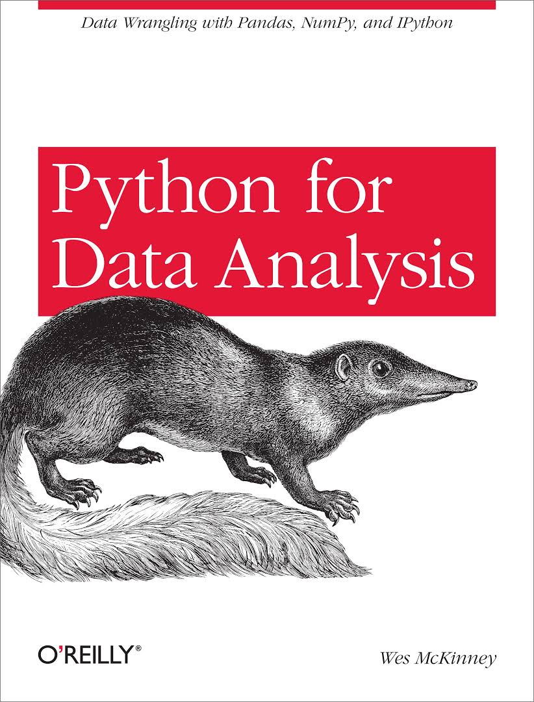

# Data-Science-Study
``` 데이터 분석을 위한 Data Science 학습자료 정리 Repo ```
## 1. Fast Campus - Data Science School 8기
- Python
- Numpy, Pandas
- Math
  - numpy로 공부하는 선형대수 기초
  - 파이썬으로 공부하는 미적분과 최적화
  - 확률론 기초
</br>

## 2. 파이썬 라이브러리를 활용한 데이터 분석 (Python for Data Analysis)

</br>
 
- CHAPTER 6 - 데이터 로딩, 저장, 파일 형식
- CHAPTER 7. 데이터 준비하기/ 다듬기, 변형, 병합
- CHAPTER 9. 데이터 수집과 그룹 연산
</br>

## 3. NAVER - CONNECT
### [ 머신러닝/딥러닝을 위한 Python ]
- 수업 자료
  - week1 ~ week5
  - Pythonic_code
  - Data_problems
- 실습 자료
</br>

## 4. Flearning
### [ Python으로 Big Data 분석하기 ]
- Python 데이터 분석의 기초 라이브러리 - Numpy 사용하기
- 쉽고 강력한 데이터 분석 라이브러리 - Pandas 사용하기
- 데이터 시각화 라이브러리 - Matplotlib 사용하기
- 데이터 처리하기 - Groupby, Pivot_table
- 실전 데이터 분석 (1) - Scapy, Selenium를 사용한 웹크롤링
- 실전 데이터 분석 (2) - Kaggle Data : Us-Baby-Names 분석하기 
</br>

## 5. Youtude
### [ 선형대수 ]
- Essence of linear algebra (3Blue1Brown)
### [ Tensorflow ]
- 모두를 위한 딥러닝 강좌 시즌 1 (홍콩과기대, 김성훈교수님)

	
